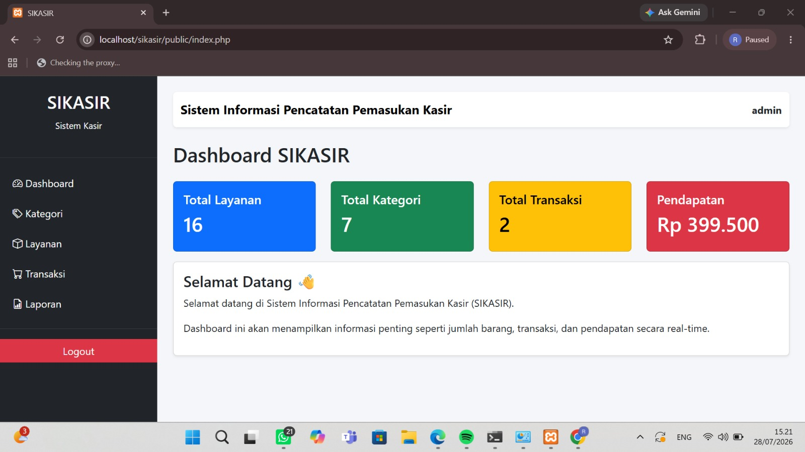
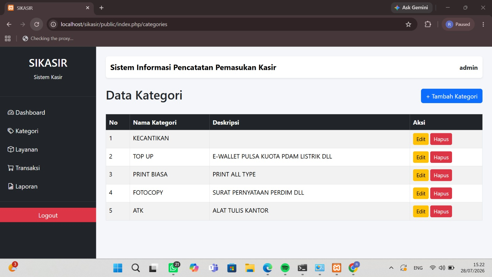
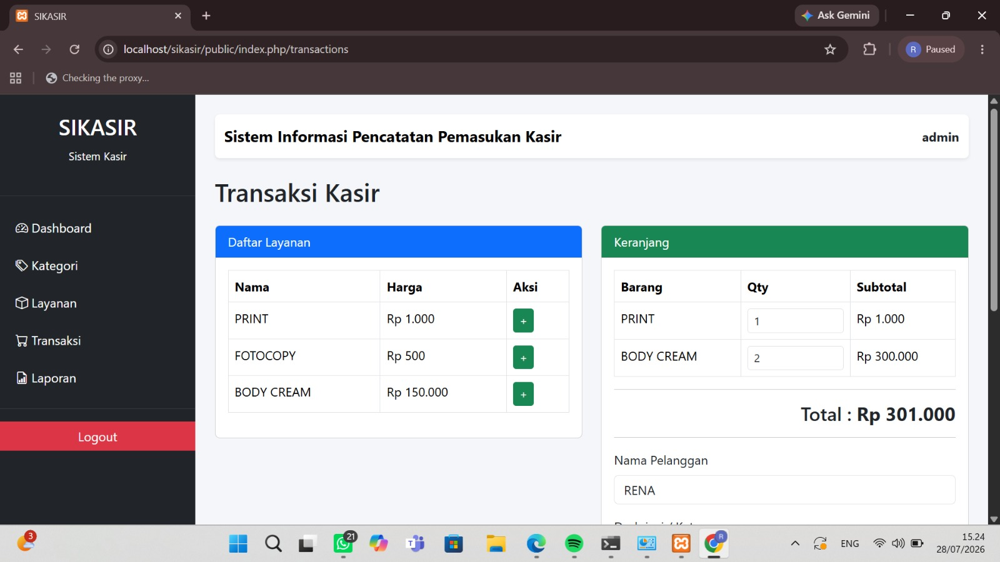
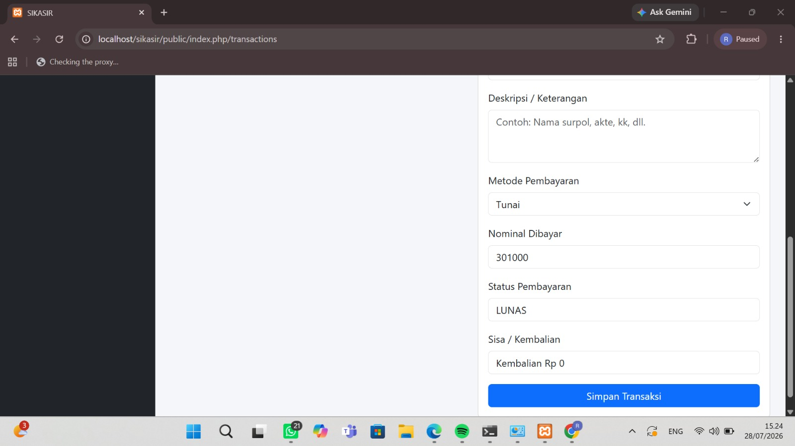
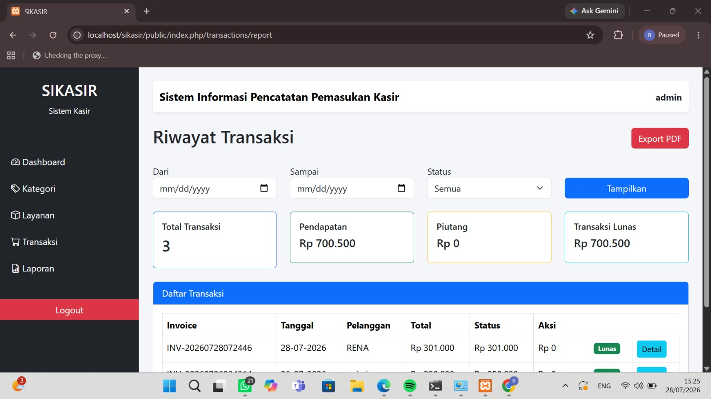

# 🖨️ SIKASIR

> Sistem Kasir Percetakan Berbasis Web menggunakan Laravel 12.

## 📖 Deskripsi

SIKASIR adalah aplikasi kasir berbasis web yang dikembangkan untuk membantu proses pengelolaan transaksi pada usaha percetakan. Aplikasi ini memudahkan pengelolaan layanan, transaksi, pembayaran, pencetakan invoice, dan laporan secara lebih cepat dan efisien.

---

## ✨ Fitur

- Login & Autentikasi
- Dashboard
- Manajemen Kategori
- Manajemen Layanan
- Sistem Transaksi
- Keranjang (Cart)
- Pembayaran
- Cetak Invoice
- Laporan PDF

---

## 🛠️ Teknologi

- Laravel 12
- PHP 8
- MySQL
- Bootstrap 5
- Blade Template
- JavaScript

---

## 📸 Screenshot

## 📸 login


## 📸 Dashboard


## 📸 layanan


## 📸 transaksi


## 📸 tansaksi lanjutan


## 📸 laporan


## 📸 detail transaksi


## 📸 invoice


---

## 🚀 Instalasi

```bash
git clone https://github.com/rnafbrna27/SIKASIR.git

cd SIKASIR

composer install

npm install

cp .env.example .env

php artisan key:generate

php artisan migrate

php artisan serve
```

---

## 👨‍💻 Developer

**RENA PEBRIANA**

GitHub: https://github.com/rnafbrna27

---

⭐ Terima kasih telah mengunjungi repository ini.
